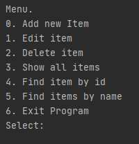

# job4j_tracker
====================================================
Project: Tracker.
----------------------------------------------------
This project is a console application. The user is shown a menu with the program's features.
The program can:
1. Add a request.
2. Replace the application with a new application by ID.
3. Delete the application by ID.
4. Display a list of all applications.
5. Search by the name of the application.
The project uses Hibernate, SQL.

Configuration
----------------------------------------------------

Usage
----------------------------------------------------

# job4j_tracker

